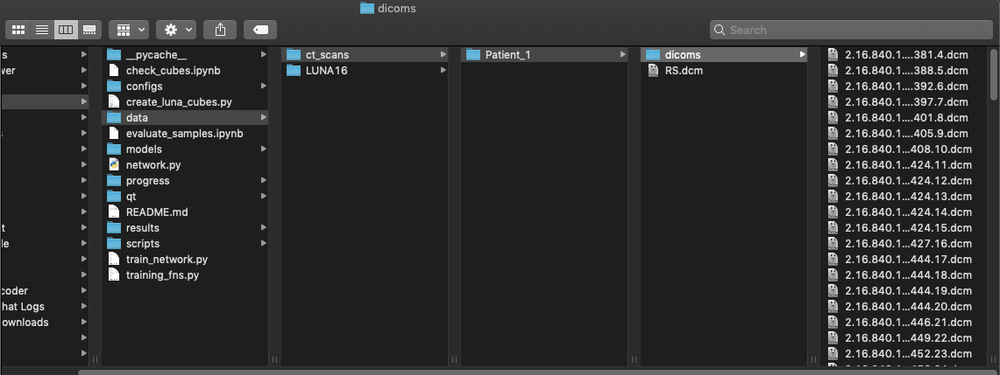

# CT Editor Graphical Interface
A GUI created to interact with the trained network post-training.

## Python Compatibility

This code has been tested using [Python 3.7.7](https://www.python.org/downloads/release/python-377/) and is known to be **not compatible with versions below Python 3.6**, however, other versions will likely work.

## Dependencies

Depending on your pip installation, you may have to replace `pip` with `pip3` in the below installations

-[numpy](https://numpy.org/): `pip install numpy`

-[matplotlib](https://matplotlib.org/): `pip install matplotlib`

-h5py: `pip install h5py`

-[pandas](https://pandas.pydata.org/): `pip install pandas` 

-[PyTorch](http://pytorch.org/): `pip install torch torchvision`

-[PyQT5](https://www.riverbankcomputing.com/static/Docs/PyQt5/): `pip install pyqt5`

-pydicom: `pip install pydicom`

-SimpleITK: `pip install SimpleITK`

-scikit image: `pip install scikit-image`

-psopy: `pip install psopy`

-scipy: `pip install scipy`

# Citing this work

Checkout our [Technical Note](https://aapm.onlinelibrary.wiley.com/doi/abs/10.1002/mp.14437). When using this tool, please consider citing our work. For example, here's the BibTeX:

```
@article{OBriain2020,
  doi = {10.1002/mp.14437},
  url = {https://doi.org/10.1002/mp.14437},
  year = {2020},
  month = aug,
  publisher = {Wiley},
  author = {Teaghan B. O{\textquotesingle}Briain and Kwang Moo Yi and Magdalena Bazalova-Carter},
  title = {Technical Note: Synthesizing of lung tumors in computed tomography images},
  journal = {Medical Physics}
}
```

# Memory Issues

3D convolutional neural networks (which is what the editor network is) are beasts and therefore, running an operation using one of these can be very computationally expensive. This problem is magnified if you use a large segment size. For instance, on my mac, I receive many memory warnings if I try to edit a cube that is larger than 39mm<sup>3</sup>. Therefore, unless you are using a powerful machine, I suggest limiting the size of the edits to smaller segments. As a reference, my machine specs are:

MacBook Air (Retina, 13-inch, 2018)

Processor 1.6 GHz Intel Core i5

Memory 8 GB 2133 MHz LPDDR3


## Editing pre-exisiting CT scans to have tumours inserted in hand-chosen locations.
                                   
## Before Starting

Move your CT scan (preferably in dicom format, although .mhd files work for part of the GUI) into the [ct_scans directory](../data/ct_scans).
    - If you are hoping to create a new dicom file with the structures, have your files formatted similar to the below path layout. Note that the RS.dcm file is the pre-existing RT structure file.
    
<p align="left">
  
</p>

## Editing your CT

1. Open your Terminal and move to the [CT_Editor/qt directory](.).

2. Run the command `python main.py` and you will see a window open.

3. Locate your CT scan (or dicom directory) and select `Load Scan`.

4. Another window will open allowing you to select a location (by selecting a location within the scan) and size of the cube (by using the scroll box labelled "Cube Side Length") that you would like to edit. 

    - Note that the selection of your location will not work if you have the zoom button (the magnifying glass) already selected; to correct for this simply press the zoom button again to deselect it.

5. Once you have suitable cube location and size, the `Apply Edit` button will run the network on the selected cube and insert the edited version. If you are unhappy with the edit, simply press `Undo Edit` to remove this edit and try a different location and/or size (see [this clip](../figures/GUI_clip.mov) for an example of how this is done).

6. You can add more than one edit if you'd like, or if you are satisfied you can (1) move onto the [segmentation](#segmenting-your-tumour) of your inserted tumours or (2) save the edited CT image as an `.npz` file using the `Save Scan` button.

## Segmenting your tumour

1. In order to continue on with the segmentation of your inserted tumours, press the `Segment Tumour` button, which will open a new window.

2. From this new window, you can view the pre-exisiting RT structures by selecting one of the options under the `Current Structure` choices.

3. To create a new contour structure, type the name of your new structure in the box next to `Create Structure` and then press the `Create Structure` button.

4. Now when you press on the image slice, points will appear that represent your new contour points. To make this easier, utilize the zoom button (the magnifying glass).

    - Note that the selection of your points will not work if you have the zoom button (the magnifying glass) already selected; to correct for this simply press the zoom button again to deselect it.

5. Once satisfied with your contours on each slice (scroll through to make sure), you can save this new scan along with the updated contour file using the `Save dcm` button. Here you will be prompted to create a `New Folder` that will enclose your dicom slices and the RT Structure file.


